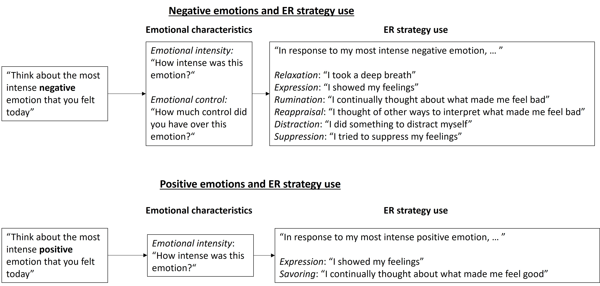

```{r setup, include=FALSE}
knitr::opts_chunk$set(echo = TRUE)

library(readxl)
library(knitr)
library(dplyr)

```

Kirtley, O. J., Lafit, G., Achterhof, R., Hiekkaranta, A. P., & Myin-Germeys, I. (2020, March 12). A template and tutorial for (pre-)registration of studies using Experience Sampling Methods (ESM). <https://doi.org/10.17605/OSF.IO/2CHMU>

The template is accompanied by an open access tutorial paper: Kirtley, O. J., Lafit, G., Achterhof, R., Hiekkaranta, A. P., & Myin-Germeys, I. (2021). Making the Black Box Transparent: A Template and Tutorial for Registration of Studies Using Experience-Sampling Methods. Advances in Methods and Practices in Psychological Science. <https://doi.org/10.1177/2515245920924686>

This template is adapted from the Preregistration Challenge template (Mellor, D. T., Esposito, J., Hardwicke, T. E., Nosek, B. A., Cohoon, J., Soderberg, C. K., ... Speidel, R. (2019, February 6). Preregistration Challenge: Plan, Test, Discover. Retrieved from osf.io/x5w7h). We have also added sections (sections 10, 19, and 21) that were adapted from the Preregistration of Secondary Data Analysis template of Van den Akker, O., Weston, S. J., Campbell, L., Chopik, W. J., Damian, R. I., Davis-Kean, P., ... Bakker, M. (2019, November 20). Preregistration of secondary data analysis: A template and tutorial. <https://doi.org/10.31234/osf.io/hvfmr>

How to register your study on the OSF using this template:

-   Download and complete the Word/PDF version of this template
-   When you are ready to register your study on the OSF, go to the "registrations" tab within the relevant OSF project and create a new registration.
-   When presented with the different options for creating a new registration, select "open-ended" registration.
-   After completing the "registration meta-data" form, you will be directed to the "summary" page. Cut and paste the completed ESM registration template document into this "summary" box.
-   If you have code or equations within your registration document, it is best to also attach a PDF copy of the registration via the "add supplemental files or additional information" option, because equations/code do not render well when copy and pasting. Code files can also be attached as supplementary materials for the registration, e.g. as R or Stata files.
-   You then have the chance to review your registration before hitting the "register" button and completing the final steps.
-   Happy registration!

# Study Information

## Title

<!--Provide the working title of your study. It may be the same title that you submit for publication of your final manuscript, but it is not a requirement.

Example: Effect of baking on positive affect in everyday life

More info: The title should be a specific and informative description of a project. Vague titles such as 'Experience sampling study pre-reg' are not appropriate.-->

The importance of emotion characteristics for emotion regulation dynamics in daily life

## Authors (required)

Dominique F. Maciejewski, Andrea Bunge, Merlijn Olthof, Edmund Lo, Eeske van Roekel, Egon Dejonckheere, Fred Hasselman, Yasemin Erbas


## Description (optional)


<!--Please give a brief description of your study, including some background, the purpose of the study, or broad research questions. 

Example: Although previous self-report surveys have found an association between baking and positive mood, no studies have yet investigated whether or not baking may correlate with momentary changes in positive affect, measured in daily life.  

More information: The description should be no longer than the length of an abstract. It can give some context for the proposed study, but great detail is not needed here for your pre-registration.-->

In this study, we examine how emotional characteristics are related to emotion regulation (ER) strategy use in daily life, separately for positive and negative emotions, using intensive longitudinal data from a 60-day ESM study.

For negative emotions, we examine two emotional characteristics, namely emotional intensity and emotional control. For ER strategies use, we examine six ER strategies, namely distraction, rumination, suppression, relaxation, expression, and reappraisal. 

For positive emotions, we examine emotional intensity as emotional characteristic (emotional control for positive emotions was not assessed). For ER strategy use, we examine two ER strategies, namely expression and savoring. 

Relationships will be assessed at the within-person level, considering both linear and quadratic relationships.  

## Hypotheses (required)


<!--List specific, concise, and testable hypotheses. Please state if the hypotheses are directional or non-directional. If directional, state the direction. A predicted effect is also appropriate here. If a specific interaction or moderation is important to your research, you can list that as a separate hypothesis. 

Example: Participants who report engaging in baking at one measurement occasion will be more likely to report higher positive affect at the following measurement occasion.-->

Our hypotheses are based on earlier research [e.g., @blanke2022; @defrance2022; @medland2020; @lennarz2019; @otoole2017]. Given the number of ER strategies assessed, we refrained from forming specific hypotheses for every single ER strategy, but rather aimed to systematically study the relationship between emotional characteristics and a broad range of ER strategies. 

H1: Linear effects for emotional intensity and ER strategy use: In general, we expect a positive relation between emotional intensity and ER strategy use, both for positive and negative emotions (directional), however we did not form any hypotheses regarding for which ER strategy this relationship would be strongest. 

H2: Linear effects for emotional controllability and ER strategy use: We expect a relation between negative emotional control and ER strategy use, but due to limited and mixed previous research, we did not form specific hypotheses about the direction of effects (non-directional). Note that we did not assess positive emotional control.

H3: Quadratic effects for emotional characteristics and ER strategy use: In addition to linear effects, we will also test for quadratic effects. Here, we hypothesize that the within-person relation between emotional characteristics and ER strategy use may be quadratic, where ER strategies are especially used at medium emotional intensity/control, but less at low emotional intensity/control and high emotional intensity/control (directional). Because we are not aware of any study that has addressed this question, we have no prior hypotheses on for which ER strategies quadratic effects would be most likely (non-directional). 

# Design Plan

<!--In this section, you will be asked to describe the overall design of your study. Remember that this research plan is designed to register a single study, so if you have multiple experimental designs, please complete a separate preregistration. For large ESM datasets that will be used for multiple analyses by different people (and possibly different labs), for clarity, we recommend one registration per study/paper. -->

## Study type (required)

Observational study combined with an experimental within-person design (i.e., personalized micro-interventions based on individual affective responses). The present study only makes use of the observational data and controls for presence of micro-interventions.

## Blinding (required for intervention studies)

<!--Blinding describes who is aware of the intervention and control group allocations within a study. Mark all that apply.-->

Blinding is within-person. Participants did not know when the intervention is timed on their affect scores or at a random point in time. Personnel who interacted directly with the participants were not aware of which intervention was based on affect dynamics and which was random.

## Is there any additional blinding in this study?

No

## Study design (required)


<!--Describe your study design. Examples include between- or within-participants designs, N=1 single-case or multi-observer designs. Typical study designs for observation studies include cohort, cross sectional, and case-control studies. 

Example: We have a cohort design.-->

Within-participants observational and experimental design

Participants were followed in daily life (observational part), plus micro-interventions were offered based on participants' individual affective stability (experimental design part; micro-interventions were applied during half of instabilities). For more information see 19. Manipulated variables.

# Sampling Plan

<!--In this section we'll ask you to describe how you plan to collect samples, as well as the number of samples you plan to collect and your rationale for this decision. Please keep in mind that the data described in this section should be the actual data used for analysis, so if you are using a subset of a larger dataset, please describe the subset that will actually be used in your study.-->

## Existing data (required)

<!--As of the date of submission, you have accessed and analyzed some of the data relevant to the research plan. This includes preliminary analysis of variables, calculation of descriptive statistics, and observation of data distributions. Please see cos.io/prereg for more information. -->

Registration following analysis of the data (Data cleaning has already been done; see prior knowledge of data for further information on this).

## Explanation of existing data (if applicable)

### Name and briefly describe the data set(s), and if applicable, the subset(s) of the data you plan to use.

<!--Example: The current study will use a subset of variables (see variables section for names) from Wave I of the RE-AL cohort study, using data from all participants within the dataset (N=220).-->

The current study will use a subset of variables (see variables section for names) from the Track your Mood Study, using data from all participants (*N*=83; but see section on Data exclusion for more information).

### Specify whether this data is open or publicly available.

<!--Example: Data are not publicly available.-->

Data are not publicly available.

### How can the data be accessed? Provide a persistent identifier or link if the data are available online, or give a description of how you obtained the dataset.

<!--Example: Data will be obtained by application to the lead researcher of the RE-AL study (Cook, E. M. M. M.; e.cook@uchoc.be). Our application has already been approved (10th January 2020).-->

The first author (D. Maciejewski) is Principal Investigator of the Track your Mood-study and has direct access to the data.

### Specify the date of download and/or access.

<!--Example: Data have not yet been accessed or downloaded. Once this post-registration has been made on the Open Science Framework, data will be released to YUM with a time and date-stamped receipt.-->

Data have already been accessed (because they were cleaned by the first author D Maciejewski). Data cleaning was finished on 28 October 2022.

### If the data collection procedure is well documented, provide a link to that information. If the data collection procedure is not well documented, describe, to the best of your ability, how data were collected.

<!--Example: The protocol of the RE-AL cohort study is published: Cook, E. M. M. M., Fondu. E., & Biccies, T. (2014). Protocol and sample for the RE-AL study: An adolescent experience sampling cohort study to investigate nutrition and mental health. Nutrition Methods, 11(3), 157-163.-->

The protocol of the Track your Mood study can be found under <https://doi.org/10.17605/OSF.IO/FX3AY>.

### Some studies offer codebooks to describe their data. If such a codebook is publicly available, link to it here or upload the document. If not, provide other available documentation. Also provide guidance on what parts of the codebook or other documentation are most relevant.

<!--Example: The codebook for Wave I of the RE-AL study is publicly available online at (URL for codebook). -->

The codebook for the Track your Mood study is publicly available online at <https://osf.io/fx3ay/files/osfstorage/62344ceaac980a08aa9516fa>

## ESM data collection procedure (required)

<!--Please specify the ESM data collection procedure in as much detail as possible, indicating your decisions for the options below.  -->

<!--Note that this pre-registration template is mainly intended for studies that involve multiple self-report measures, where participants are assessed at least once per day in the context of their daily life. As there is a large variation in the methodology of these studies, not every option below may be applicable and may therefore be indicated as such.-->

Note that the Track your Mood study had a Day questionnaire, an Evening questionnaire and micro-interventions. 
In this pre-registration, only data from the Evening questionnaire are used and as such only procedures relevant for this are described. 
Please see <https://doi.org/10.17605/OSF.IO/FX3AY> for the complete protocol of the "Track your Mood" Study.

Micro-interventions were never scheduled during the evening assessments. Nevertheless, we will control for presence of micro-interventions.

### Study duration (number of days)

<!--Example: The ESM period lasts for 6 days. If participants have filled out less than 30% of all beeps after this period, the ESM period is extended by 2 days.-->

The ESM period was 60 days (+ onboarding day).

### Type of sampling scheme:

<!-- Details of the sampling scheme may be included here, including the type of scheme, the number of beeps, sampling rate, timing of beeps, and potential minimum windows between consecutive beeps. NB: Researchers can provide a rationale for these decisions in section 12. -->

<!-- The sample scheme can be one of the following: Interval-contingent, signal-contingent (with fixed or random intervals), event-contingent (prompted or participant-initiated), or mixed. -->

<!-- Example: We use a mixed sampling scheme, with both semi-random and fixed elements. Participants receive 10 notifications per day, between 7.30 AM and 10.30 PM on weekdays, and between 9.00 AM and 0.00 PM on weekend days. Each notification is randomly scheduled within one of ten 90-minute blocks throughout the day (i.e., notification 1 between 7.30 AM and 9.00 AM; notification 2 between 9.01 AM and 10.30 AM, etc.). A window is scheduled between notifications, so that there are at least 15 minutes between consecutive notifications. In addition, a morning questionnaire is continuously available to participants between 7.00 AM and 10.00 AM each day to fill out a morning questionnaire. -->

<!-- Example: We use an event-contingent sampling scheme. Participants are asked to fill out the questionnaire following each social interaction lasting over 15 minutes. A maximum of 12 social interactions per day can be recorded. (Alternatively: Participants are prompted with the questionnaire on their mobile phone after it has made contact via Bluetooth with their dyad partner. Participants are not prompted if they have already filled out a questionnaire in the last two hours) -->

The sampling scheme was signal contingent. 
Participants received one notification per day at 21:00 hours to fill in the evening questionnaire. 
The notifications occurred via their mobile phones through the application "m-path" [www.m-Path.io; @mestdagh2022], which they had previously installed and set up. 
While 21:00 was set as a default notification time for all participants, individual adjustments could be made during the intake meeting with the researchers. 
Additional personalization of the participant schedules was also possible at request throughout the study weeks.

### Total number and type of items (open-ended or closed) and estimated questionnaire duration. Indicate the total number of items per assessment, also when items are not used for the analyses specified in this pre-registration. A full list of items should be provided in an appendix.

<!-- Example: The ESM questionnaire consists of a minimum of 30 and a maximum of 45 multiple choice items, and two open-ended items. Questionnaire length varies as a function of certain item responses (e.g., some items are only presented after participants indicate that they are alone). Following a pilot, we estimate the completion time for each questionnaire to range from two to four minutes. -->

Total number of items of the evening questionnaire was 28 items. 
Completion took around 2 minutes.

### Time-out specifications. Here you can indicate details about the amount of time that participants have to respond to a questionnaire (i.e., response time), and the potential maximum amount of time that participants have to respond to one item, or complete the full questionnaire.

<!-- Example: Following the initial notification, the ESM questionnaire is available to the participant for 15 minutes. Once the questionnaire has been opened, it will time out and become unavailable if participants have not completed any item within two minutes, or after they have been unable to complete the full questionnaire within 15 minutes. -->

Following the initial notification, the ESM questionnaire was available to the participant for 2 hours. 
There was no additional time restriction once the questionnaire had been opened.

### Additional passive monitoring.

<!-- Example: In addition to completing the ESM, participants' heart rate is also measured throughout the ESM week, using the Fitbit Charge 2.-->

None.

### Incentivization and increasing participant engagement.

<!-- Please provide a description of the incentive for participation, and of all efforts to increase participant engagement/compliance, such as participation reminders via telephone or text, participation fees that are conditional on the compliance rate, or potential gamification of the ESM. Please also indicate whether participants have access to information about their compliance rate during the ESM period.-->

<!-- Participants are informed that they receive 10 Euro if they have filled out at least 20 beeps throughout the ESM week, with an additional 0.50 Euro per filled out beep. Participants are also informed that they will receive no fee if they have filled out less than 20 beeps. Participants will not have access to their compliance information during the testing period and will not receive reminders to complete notifications.-->

Participants could either receive a voucher (VVV or bol.com bon) for 25 Euros or 2.5 study participant points (applicable for e.g. psychology students). 
If participants dropped out, they would receive the proportional amount of money and/or points. 
The researchers contacted participants when compliance was lower than 70%. 
Compliance was checked every few weeks. 
Participants could not see their own compliance in the app.

Additionally, we offered participants to see their individual data after the study had been completed. 
Participants were encouraged to contact the research team with questions or issues via e-mail, phone call, or WhatsApp. 
The team was available via these mediums throughout the entire study period.

### Please indicate any additional details that are relevant to the ESM data collection procedure.

See <https://doi.org/10.17605/OSF.IO/FX3AY> for additional information on the data collection procedure (recruitment, data-viewing sessions etc.)

## Sample size (number of participants) (required)

<!-- Describe the sample size of your study. If individuals are clustered in higher-order units, e.g. schools or groups according to diagnosis, then describe the size required for each unit. 

Example: We will include a total of 2000 participants in our sample, 1000 12 year-olds, 500 14 year-olds, and 500 16 year-olds. -->

We aimed at including 100 students for our study. The initial goal of 100 students was based on typical sample sizes of earlier studies [@dejonckheere2021; @eisele2021; @haines2016; @hjartarson2021; @medland2020; @mey2020]. In total, 83 participants started the study, and 77 students completed the study fully (i.e., 6 participants dropped out during the 60 days).

## Rationale for sample size: Temporal design and number of participants (if applicable)

<!-- Please provide a rationale justifying your decisions regarding the sample size. This includes the temporal design (number of days and number of measurement occasions per day) and the number of participants included within the study. For example, the temporal design can be selected taking into consideration protocols based on previous research that studied a similar target process. The rationale for selecting the number of participants can include a power analysis. Arbitrary constraints such as time, money and personnel should also be explicitly reported. When considering sample size, researchers should take into account the expected compliance rate, as this can significantly affect power and the quality of the data.\ -->

<!--     Example: We estimated power using Monte Carlo based simulation for a two-level model assuming an ESM protocol of 6 days with 10 measurement occasions per day. Our goal was to obtain .95 power to test a significant effect for the main hypothesis of interest (i.e., where the null hypothesis is that the main effect of interest is zero, assuming a significance level of 0.05). -->

<!--   More information: This gives you an opportunity to state specifically how the sample size will be determined. A range of reasons can be stated; remember that transparency is key here. If you state any reason for a sample size upfront, it is better than stating no reason and leaving the reader to "fill in the blanks." An acceptable rationale would include a power analysis, an arbitrary number of subjects, or a number based on previous studies, time or monetary constraints. -->

See <https://doi.org/10.17605/OSF.IO/FX3AY> for a rationale on the sample size of the overall project.

For the current study, we conduced a power calculation with a Monte Carlo Simulation with 1000 replications using parameters estimates from other pre-existing data with code from the Shiny app from @lafit2021. Big thanks to Ginette Lafit, who adjusted the code, so that we could test for power of the quadratic effects! The code can be found in the file *Power-analyses_main.R*.

As pre-existing data, we used the publicly available data from the publication of @medland2020, which can be found under <https://osf.io/h4gx3>. 
We believe that this dataset is suitable for our power analyses for several reasons. 
First, the samples are comparable in that both are mostly composed of undergraduate students. 
Second, we used the same items for the ER strategies and for the emotional characteristics (with some adjustments occuring in the translation). 
The ER strategy items are based on the RESS-EMA, which was validated in the study of @medland2020. 
Note, that the original questionnaire had two items per strategy. 
For the Track your Mood study, we chose one item per scale. 
Please see <https://osf.io/vg2wq> for more information on which items we chose and why. 
For the power analyses, we are only using the items that we used in the Track your Mood study. 
Note that the time-scale differs, where the study by @medland2020 assessed ER strategy use 8 times per day for 7 days, and the Track your Mood study assessed ER strategy use 1 time per day for 60 days.

The following variables are available:

1.  ER strategies (within-person level): 
    -   Relaxation: dampening of autonomic arousal (we used item 2)
    -   Expression: active expression of emotion (we used item 1) (note that this is also referred to as engagement)
    -   Rumination: sustained attention (we used item 2)
    -   Reappraisal: cognitive reframing (we used item 1)
    -   Distraction: diverting attention (we used item 2)
    -   Suppression: inhibition of emotional expression (we used item 1)

2.  Emotional characteristics (within-person level): 
    -   emotion intensity
    -   emotion control

The results of our analyses can be found in the tables below. 
Overall, results indicate that power for the linear and quadratic effects depends on the emotional characteristic and ER strategy combination.  
For most of the combinations, except for emotional intensity & distraction, emotional control & expression, emotional control & distraction, emotional control & rumination, there is sufficient power (> .80) for either the linear **or** the quadratic effect.  
For emotional intensity, power is > .75 for the linear effect, but insufficient power for the quadratic term (.09 - .45).   
For emotional control, power is not sufficient for any of the linear effects. 
However, there is sufficient power for the quadratic effect for relaxation, reappraisal and suppression (> .82).

*Table emotional intensity:*

```{r table power emo int, echo=FALSE}
power_int <- read_excel("../preregistration/power_emo_intensity.xlsx")
power_int <- power_int %>%
  dplyr::filter(N == 80) %>% 
  dplyr::select(predictor, N.Rep.Converged, power.X, power.X2) %>%
  dplyr::rename("power linear term"="power.X",
               "power quadratic term"="power.X2",
               "Number of\ replications converged"="N.Rep.Converged") %>% 
  mutate_at(3:4, round, digits=2) 

kable(power_int)

```


*Table emotional control:*

```{r table power, echo=FALSE}
power_cont <- read_excel("../preregistration/power_emo_control.xlsx")

power_cont <- power_cont %>%
  dplyr::filter(N == 80) %>% 
  dplyr::select(predictor, N.Rep.Converged, power.X, power.X2) %>%
  dplyr::rename("power linear term"="power.X",
               "power quadratic term"="power.X2",
               "Number of\ replications converged"="N.Rep.Converged") %>% 
  mutate_at(3:4, round, digits=2) 

kable(power_cont)

```

@medland2020 have only data available on negative emotions. 
However, we do not expect that power will be much different for the case of positive emotions.

## Stopping rule (if applicable)

<!-- If your data collection procedures do not give you full control over your exact sample size, specify how you will decide when to terminate your data collection. This may refer to the termination of additional participant inclusion as well as terminating data collection of ESM data for individual participants.  -->

<!-- Example: Every Friday evening, we will post participant sign-up slots for the following week. There will be 20 testing slots available per week. We will post 20 new slots each week if we are below 320 participants on the Friday preceding a new testing week.  -->

<!-- More information: You may specify a stopping rule based on p-values only in the specific case of sequential analyses with pre-specified checkpoints, alphas levels, and stopping rules. Unacceptable rationales include stopping based on p-values if checkpoints and stopping rules are not specified. If you have control over your sample size, then including a stopping rule is not necessary, though it must be clear in this question or a previous question how an exact sample size is attained. -->

N/A

# Variables

<!-- In this section, you can describe all variables (both ESM and non-ESM variables and manipulated and measured variables) that will later be used in your confirmatory analysis plan. In your analysis plan, you will have the opportunity to describe how each variable will be used. If you have variables that you are measuring for exploratory analyses, you are not required to list them, though you are permitted to do so. -->

## Measured non-ESM/time invariant variables (if applicable)

<!-- Describe each variable that you will measure, which is not measured during the ESM period. This will include outcome measures, as well as any predictors or covariates that you will measure outside of the ESM period. You do not need to include any non-ESM variables that you plan on collecting if they are not going to be included in the confirmatory analyses of this study. -->

<!-- Example: The first baseline predictor variable will be age in years, reported by participants at baseline. The second baseline predictor variable will be educational level, reported by participants as years of formal education. -->

<!-- More information: Observational studies will include only measured variables. As with the previous questions, the answers here must be precise. For example, 'intelligence,' 'extraversion,' and 'aggression' are too vague. Acceptable alternatives could be 'IQ as measured by Wechsler Adult Intelligence Scale' 'number of close friends,' and 'number of threat displays'. -->

We will use age in years and gender (male, female, non-binary) as a covariate, which are reported by participants at baseline. 

The exact item wording and variable names can be found in the codebook, which is publicly available online at <https://osf.io/fx3ay/files/osfstorage/62344ceaac980a08aa9516fa>

## Measured ESM/time-variant variables (required)

<!--  Describe each variable that is measured during the ESM period. This will include outcome measures, as well as any predictors or covariates that you will measure during ESM, or that were measured during the ESM period (in the case of pre-existing data). If the ESM questionnaire includes items other than those used in the current pre-registration, provide an appendix with the full ESM questionnaire. Specify the level at which each variable is measured and describe the response scale (Visual Analogue Scale, Likert scale, categorical, or other, in which case, specify). Also, indicate whether items were presented in a randomized or fixed order.  -->

<!-- Examples: The ESM predictor variable will be stress. We will measure this at the momentary level throughout the day by asking participants to indicate their agreement with the statement 'I feel stressed' (on a scale of 1-7, 1 being 'not at all', 7 being 'very much'). The first ESM outcome variable will be engagement. We will measure this at the momentary level by first asking participants 'What are you doing right now?' (an open-ended question with a maximum of 150 characters). We will then measure engagement at the momentary level by asking participants 'How engaged are you in this activity?' (on a scale of 1-7, 1 being 'not at all', 7 being 'very much').  -->

<!-- More information: Indicate the order and, if applicable, the branching in the ESM questionnaire. For example, 'if yes to question '1. Since the last notification, I have consumed alcohol', question 2. will follow: 'Who were you with at the time of alcohol consumption? Partner; Family; Friends; Colleagues; Acquaintances; Unknown people / Others; No one'.  -->

Here, we will report the English translations. The items in Dutch can be found in the codebook, which is publicly available online at <https://osf.io/fx3ay/files/osfstorage/62344ceaac980a08aa9516fa>

We assessed emotional characteristics and ER strategy use separately for positive and negative emotions. 
See the following figure for the study design and order of questions:

```{r figure design, echo=FALSE, fig.cap="Figure 1. Design of measuring emotional characteristics and ER strategy use"}



```


The ESM predictor variables will be two measures of emotional characteristics for negative emotions: negative emotional intensity and negative emotional control [@medland2020]. 
For positive emotions, we only assessed positive emotional intensity (and not controllability), because when we designed the study, we hypothesized that emotional control would play less of a role for positive emotions.

Participants were asked to think about the most negative/positive emotion of that day ("Think about the most negative/positive emotion that you felt today").  

Emotional intensity was measured with the item "How intense was this emotion" with a VAS response scale ranging from 0 (*not at all*) to 100 (*very intense*). 

Emotional control for negative emotions was measured with the item "How much control did you have over this emotion?" with a VAS response scale ranging from 0 (*not at all*) to 100 (*complete control*). 

The ESM outcome variables will be ER strategies from the RESS-EMA questionnaire [@medland2020]. 
The RESS-EMA only has items about the regulation of negative emotions. However, we based the two positive ER strategy use items  that we thought we most relevant to the maintenance of positive emotions on the RESS-EMA questionnaire (savoring and expression).

All items were rated on a VAS response scale ranging from 0 (*not at all*) to 100 (*very much*).

Participants were asked to indicate the intensity to which they used a certain ER strategy after being prompted with "In response to my emotions,..."
The number of ER strategies assessed differed for negative versus positive emotions:

For regulation of negative emotions, six items were used to assess ER strategy use:
"In response to my [most intense negative] emotion..."

Relaxation was measured with the item "I took a deep breath".\
Expression was measured with the item "I showed my feelings".\
Rumination was measured with the item "I continually thought about what made me feel bad".\
Reappraisal was measured with the item "I thought of other ways to interpret what made me feel bad".\
Distraction was measured with the item "I did something to distract myself".\
Suppression was measured with the item "I tried to suppress my feelings".

For regulation of positive emotions, two items were used to assess ER strategy use:
"In response to my [most intense positive] emotion..."

Expression was measured with the item "I showed my feelings".\
Savoring was measured with the item "I continually thought about what made me feel good".

Please see <https://osf.io/fx3ay/files/osfstorage/62344ce61372e808bfcc59c2> for more information on translation of the RESS-EMA items. 

Presence of micro-interventions will be coded as a time-varying dummy variable and will be included as a covariate (0 = participants received no micro-intervention that day, 1 = participant received a micro-intervention that day).

## Open-ended questions (if applicable)

<!-- Describe any open-ended questions that will be coded and used in confirmatory analyses. How much text can be entered? How will coding be done? Specify the level of each open-ended question (e.g. each measurement occasion, once a day, or at the end of the ESM period). This is not applicable to questionnaires including only closed questions.  -->

<!-- Example: At each measurement occasion, participants will be asked an open-ended question 'What were you doing at the moment before the notification arrived?' Participants can respond with a maximum of 150 characters. Answers will be coded into two categories: work and non-work. Answers will be coded as work if they include a minimum of one word from the 'work' category in Fictional Language Processing Software.  -->

N/A for this study.

## Indices (if applicable)

<!-- If any measurements collected during the ESM period or outside of it are going to be combined into an index (or even a mean), what measures will you use and how will they be combined? Include either a formula or a precise description of your method.  For any indices or summary statistics used in confirmatory analyses, specify the level at which the statistic is constructed (such as per person, day, or measurement occasion). This may apply to both questionnaire measurements and measurements collected via passive monitoring. If you are using a more complicated statistical method to combine measures (e.g. a factor analysis), you can note that here but describe the exact method in the analysis plan section. -->

<!-- Example: We will use the momentary-level within-person beta coefficients of the association between stress ('How unpleasant was the most important event that happened to you since the last beep?', 0 = not at all, 7 = very much) and negative affect (mean of items 'I feel down', 'I feel anxious', and 'I feel insecure', 0 = not at all, 7 = very much) as an index of stress reactivity.  -->

<!-- More information: If you are using multiple pieces of data to construct a single variable, how will this occur? Both the data that are included and the formula or weights for each measure must be specified. Standard summary statistics, such as means do not require a formula, though more complicated indices require either the exact formula or, if it is an established index in the field, the index must be unambiguously defined. For example, positive affect is too broad, whereas daily mean of positive affect items: 'I feel relaxed', 'I feel content', and 'I feel cheerful' each measured on a 1-7 scale (1 = not at all, 7 = very much) is appropriate.  -->

Gender (recoded): Because there are few males and only one non-binary person in our dataset, gender will be recoded for analyses into female (0) and other (1; including male and non-binary). 

ER variability: We will calculate momentary ER variability in two steps. First, we calculate Bray-Curtis dissimilarity between the moment of interest and all other moments within the same participant. 
In total, there will be (n - 1) comparisons, where n is the number of observations within a participant.
Then, we take the mean of (n - 1) instances of Bray-Curtis dissimilarity. 
In this way, momentary ER variability reflects how much a participant deviated from their usual style of emotion regulation at the moment of interest. 
This measure has been previously validated for the use in ESM research [see @lo2023]. 
Given that this measure is new, the analyses using the ER variability index were exploratory (see under exploratory analyses).

## Manipulated variables (if applicable)

<!-- Describe all ESM and non-ESM variables that you plan to manipulate and the conditions or treatment arms of each variable. Specify the level (/timing) of manipulation of each variable. This is not applicable to any observational study.  -->

<!-- Example: Participants will walk for 30 minutes once a day. We will assign participants to two daily walking categories for the duration of the ESM period. The categories of this variable are indoors and outdoors. -->

<!-- Example: We will assign participants to two notification conditions for the duration of the ESM period. Participants will receive either 10 notifications per day or 6 notifications per day. -->

<!-- 19.2.  More information: For any experimental manipulation or treatment, you should give a precise definition of each manipulated variable. This must include a precise description of the values at which each variable will be set, or a specific definition for each categorical treatment. For example,' loud or quiet', should instead give either a precise decibel level or a means of recreating each level. 'Presence/absence' or 'positive/negative' is an acceptable description if the variable is precisely described. -->

N/A

# Prior knowledge of data (if applicable)

## List the publications, conference presentations (papers, posters), and working papers (in prep, unpublished, preprints) you have worked on that are based on the data set. Describe which variables you have previously analyzed and which information you used in these analyses. Limit yourself to variables that are relevant to the current study. If the dataset is longitudinal, include information about which wave(s) of data were previously analyzed. Also, include any knowledge regarding missingness within the dataset or compliance, including at what level e.g. overall compliance, compliance for different types of reports, the mean level of compliance, range of compliance across participants.

<!-- Example: YUM has previously used the RE-AL Wave I dataset to investigate the relationship between positive affect (variables: mood_cheerful, mood_relaxed and mood_satisfied) and frequency of snacking (variable: eat_snack). Both of these variables will be used in the current study. YUM's previous analyses using these variables were pre-registered (URL to pre-reg). They were published as: Munch, Y.U., Cook. E. &, Monster, M. M. M. (2016). Happy snacking: A real-time monitoring study of positive affect and snacking using the RE-AL cohort. Journal of Snack Studies, 21(3), 244-252, and were also presented by YUM as an oral presentation at the International Association of Nutrition conference, New York, 22-26th September, 2014 (link to abstract; link to slides). All of the authors of the current study are aware of these findings. 17 participants had more than 80% missing data due to a technical issue and these participants were excluded from Munch and Cook's (2016) study because of this. Overall compliance was 83%.   -->

<!-- More information: It is important to specify all the different ways you have previously used the dataset because this will provide information about how you have been exposed to the data previously. If available, include references to any relevant publications or pre-prints. This information helps you to establish any previous knowledge of the data you may have, which is relevant for the next question. -->

None. However, during writing the pre-registration, the individual data of participants has been seen due to the individual data-viewing sessions that the participants were offered post data-collection. 
Moreover, data-cleaning has been done already and for this descriptive statistics have been calculated to check for out of range values. 
We also calculated scale scores and reliabilities for the baseline and follow-up Qualtrics questionnaires. 
Additionally, there are currently a few master-theses that use the across-time mean-aggregated ER Scales in relation to each other and to some Qualtrics questionnaires, such as self-esteem or neuroticism. 
Importantly, none of these worked with the raw time-series data!

## What prior knowledge do you have at the time of pre-registration about trends in the data set you will be working with?

<!-- More information: Are you aware of summary statistics or the statistical distribution of variables, or do you know about correlations between variables? Your prior knowledge could stem from working with the data first-hand, from reading previously published research, or from codebooks. Also provide any relevant knowledge of different subsets of the data (e.g., a different wave than you will be using). Finally, provide information about your prior knowledge for every author separately. -->

<!-- Example: Apart from YUM, none of the other co-authors has had prior access to any of the variables within the RE-AL dataset. All authors of the current study are aware of Munch, Cook & Monster's (2016) study on positive affect and snacking, therefore all authors are aware that the ICC for this relationship (positive affect ~ snacking + age + gender + (SubjID| 1) is .36.  -->

From data-cleaning, we know that there is an average compliance rate of 67% of the evening asssessments (after removal of duplicate beeps and pilot-testers). 

From the master theses (which have not been completed yet), we know that the *imean* and *iSD* (i.e., scores aggregated within individuals across time with the M and the SD) of the ER strategies are approximately normally distributed and positively correlated with each other on a between-person level. 
The between-person mean of *imean* is between 50 to 55 for the different strategies and the between-person mean of *iSD* is between 20 and 25.

No analyses have been conducted on the raw time-series data and within-person level.

# Analysis Plan

<!-- You may describe one or more confirmatory analyses in this pre-registration. Please remember that all analyses specified below must be reported in the final article, and any additional analyses must be noted as exploratory or hypothesis-generating. -->

<!-- A confirmatory analysis plan must state upfront which variables are predictors (independent) and which are the outcomes (dependent), otherwise, it is an exploratory analysis. You may describe any exploratory work here, but a clear confirmatory analysis is required.  -->

## Statistical models (required)

<!-- What statistical model will you use to test each hypothesis? Please include the type of model (e.g. mixed effect models, repeated measurement ANOVA, SEM, etc.) and the specification of the model (this includes each variable that will be included as time-varying and time-invariant predictors and outcomes).  -->

<!-- If a multilevel analysis is applied, a description of the following elements can be included: -->

<!-- Distribution of the outcome variable. Example: the outcome variable is a binary variable. Therefore, we will use a logistic mixed-model. -->

<!-- Distribution of the within-subject errors. Example: the errors are assumed to be Gaussian distributed and serially correlated. The serial correlation will be modeled using an AR(1) process. -->

<!-- Distribution of the random effects. Example: the model will include a random intercept and a random slope, and will be assumed to be bivariate Gaussian distributed with an uncorrelated correlation structure. -->

<!-- Fixed-effect predictors, please specify which predictors are considered fixed and which are considered random. Example: the model includes the variable momentary stress that is assumed to be fixed (does not include a random slope). -->

<!-- Transformations applied to time-varying explanatory variables and time-invariant explanatory variables. Example: the time-varying variable is centered using the persons' mean. The time-invariant variable is centered using the grand mean. -->

<!-- Inclusion of lag-dependent variables. Example: the model includes the lagged predictor. The variable has been lagged within days and within participants. -->

<!-- More information: please specify any interactions, subgroup analyses, pairwise or complex contrasts, or follow-up tests from omnibus tests. Remember that any test not included here must be noted as an exploratory test in your final article.  -->

<!-- More information: This is perhaps the most important and most complicated question within the pre-registration. As with all of the other questions, the key is to provide a specific recipe for analyzing the collected data. Ask yourself, is enough detail provided to run the same analysis again? Be aware of instances where the statistical models appear specific, but actually leave openings for analytic flexibility. See the following examples:  -->

<!-- Example: If someone specifies a multilevel model with three time-varying predictors (X1, X2 and X3) and we are interested in estimating the effect of predictor X1, there is still flexibility over the specification. For example, does the model include a random slope for each of the three predictors? Does the model only consider a random slope for predictor X1? The two models produce different estimates of the main effect of predictor X1.  -->

<!-- Example: The data has a three-level structure: repeated measurements (level 1) nested within days (level 2) and nested within an individual (level 3). If someone specifies a multilevel model with a random slope, there is still flexibility over the specification of the random effects: for example, the model includes a random intercept and a random slope that are allowed to vary within days and within individuals. Or the model includes a random intercept that is allowed to vary within days and within individuals and a random slope that is allowed to vary within individuals). These specifications imply different statistical models. -->

The data has a two-level structure: repeated measurements (daily, level 1) nested within individuals (level 2). We will conduct multilevel regression analyses.

*Analyses for within-person relation between emotional characteristics and ER strategy use - linear and quadratic effects:*

-   Time-variant dependent variable: ER strategy (either single strategy (from 6 strategies in total) or ER strategy variability; interval)\
-   Time-variant independent variables: Linear and quadratic term of emotion characteristics (intensity and control; interval, person-mean centered)\
-   Time-variant covariates: Presence of micro-interventions (categorical, dummy-coded)\
-   Time-invariant covariates: Age (continuous, grand-mean centered) and Gender (categorical, dummy-coded) at baseline

For all analyses, we will include random intercepts and random slopes and their correlation for emotion characteristics (for the linear and quadratic terms). We will test for the significance of random effects by comparing nested models with increasingly random-effects structures using the Likelihood Ratio Test. The errors are assumed to be Gaussian distributed and serially correlated. The serial correlation of the errors will be modeled using an AR(1) process.

Separate models will be conducted for each model combination. For negative emotions, there are 14 models in total for the two different emotion characteristics (intensity and control) and the different ER strategy outcomes (six ER strategies: relaxation, expression, rumination, reappraisal, distraction, suppression or ER variability calculated with Bray-Curtis dissimilarity). 
For positive emotions, there are 2 models in total, because we only have one emotional characteristics variable (emotional intensity) and two ER strategies (expression, savoring).

## What will you do should your data violate assumptions, your model not converge or some other analytic problem arises?

<!-- Example: We will specify a linear-mixed effect model to estimate if there are group differences in Depression between participants diagnosed with major depressive disorder and control subjects. The dependent variable is Depressed and the predictors are the following lagged variables: Depressed, Angry, Anxious, Happy and Relaxed. To select the structure of the random effect we will split the dataset into training and test data to conduct adequate post-selection inference. We will use a ratio of 40/60 (i.e. training/test set). Using the training set, we will estimate a linear mixed-effect model using maximum likelihood, and we will compare three random effect structures: (1) all predictors have a fixed slope; (2) all predictors have a random slope and correlation structure is unrestricted; and (3) all predictors have uncorrelated random slopes. The model will be selected by comparing the AIC. We will fit the model with the minimum AIC using the test dataset.  -->

<!-- More information: It is, of course, impossible to predict every single way that things might go awry during the analysis. One of the variables may have a strange and unexpected distribution, one of the models may not converge because of a quirk of the correlational structure, and you may even encounter error messages that you have never seen before. However, as with the questions above, you can use your prior knowledge of the dataset to set up a contingency plan for transforming a variable if the data do not behave precisely as you expect. (e.g., 'The dependent variable is the number of negative events during the ESM period. We assumed that the distribution is Poisson. However, if the variable exhibits a high number of zeros, we will fit a zero-inflated Poisson model'). Which transformations to perform depends on the context. In some cases, it may be reasonable to use the logarithmic transformation for the dependent variable, however, you should verify that residuals in the fitted model are independent and normally distributed. The most important thing is to be clear and transparent about this process in the final write-up so that you can reasonably assure evaluators that transformations were not applied inappropriately or arbitrarily.  -->

First, optimization algorithms will be adjusted with more iterations added.

Second, random effects will be removed in descending complexity, namely:\
-   correlation random slope quadratic term emotional characteristics and random intercept emotional characteristics\
-   random slope quadratic term emotional characteristics\
-   correlation random slope linear term emotional characteristics and random intercept emotional characteristics\
-   random slope linear term emotional characteristics\

## Transformations (if applicable)

<!-- If you plan on transforming, centering, recoding the data, or will require a coding scheme for categorical variables, please describe that process. -->

<!-- Example: If you estimate a model that includes a lag-dependent variable as a predictor, then there should be information on how the overnight or missed beeps are going to be treated (e.g. for each day the first beep of the day will be set as a missing observation). -->

<!-- Example: The time-varying predictor will be centered using the individual means and the time-invariant predictor will be centered using the grand mean. -->

<!-- More information: If any categorical predictors are included in a regression, indicate how those variables will be coded (e.g. dummy coding, summation coding, etc.) and what the reference category will be. -->

The emotional characteristics and ER strategy use (scale 0-100) will be divided by 10 to prevent that the quadratic terms will get too large, which could potentially lead to problems with model estimation.\
The time-varying predictors will be centered using the individual means (person-mean centered) and the time-invariant predictor will be centered using the grand mean.

## Inference criteria (if applicable)

<!-- What criteria will you use to make inferences? Please describe the information you will use (e.g. p-values, Bayes factors, specific model fit indices), as well as the cut-off criterion, where appropriate. Will you be using one or two-tailed tests for each of your analyses? If you are comparing multiple conditions or testing multiple hypotheses, will you account for this? -->

<!-- Example: We will use a Likelihood ratio test to test the difference between two nested models using the Chi-squared distribution. If the p-value of the likelihood ratio test is inconclusive we will use parametric bootstrap. The parametric bootstrap is a more efficient test.  -->

<!-- More information: P-values, confidence intervals, and effect sizes are standard means for making an inference, and any level is acceptable, though some criteria must be specified in this or previous fields. Bayesian analyses should specify a Bayes factor or a credible interval. If you are selecting models, then how will you determine the relative quality of each? In regards to multiple comparisons, this is a question with few 'wrong' answers. In other words, transparency is more important than any specific method of controlling the false discovery rate or false error rate. One may state an intention to report all tests conducted or one may conduct a specific correction procedure; either strategy is acceptable. -->

We will conduct two-tailed tests and use the inference criteria *p* \< 0.05.

## Missing data (if applicable)

<!-- Expectations of missingness. This is a common feature of ESM studies, for example, a participant can drop out and all their data can be missing, participants can miss entire notifications resulting in missing (notification-level) observations, or a participant can have partially completed questionnaires resulting in (item-level) missingness. Provide a justification for your expectations. -->

<!-- Example: We expect fewer than 5 participants to drop out, approximately 20% of notifications to be missing within the non-dropouts, and approximately 90% of the notifications to be completed within the non-dropouts. These expectations are based on an ESM study with a similar design and population (Voorbeeld et al., 2019). -->

<!-- More information: You may base your expectations on e.g., pilot data or existing literature. -->

We know the following information from data cleaning. For more information, please see the codebook <https://osf.io/fx3ay/files/osfstorage/62344ceaac980a08aa9516fa>:

6 participants dropped out during the study (i.e., 77 completed all 60 days), however we can use the data from the available days. Additionally, 1 person only received 1 evening assessment and two persons did not receive all evening assessments due to a technical error. The former person will be excluded, because there is no variation in the data across time.

79 of 83 participants have data on the baseline questionnaire (age, gender). 
Missing values on the baseline questionnaire will be imputed, so that people can be included in the multilevel models.
Across all participants, 67% of all ESM questionnaires were filled in. The average number of filled in evening questionnaires was *M* = 38 per person (*SD* = 15, range = 1 - 60).

## Data exclusion (if applicable)

### Irrespective of whether data are pre-existing, will participants or observations be excluded based upon missingness, due to either technical issues or compliance? If so, specify a decision rule for this including:

#### How will you define a valid observation?

<!-- Example: All observations completed within 1-10 minutes will be defined as valid. -->

We have no items that directly assessed careless responding. However, in accordance with earlier research [e.g., @dejonckheere2021], a zero variance of time-varying variables could be seen as careless responding. We will compute the variance for our primary predictors emotional intensity and emotional control and will exclude participants for whom this variance is zero. Additionally, measurement occasions where the entire questionnaire was completed in less than 1 minute will be excluded (the total questionnaire was 28 questions, including some open questions).

The following measurement occasions will be excluded, because they likely indicate technical errors (from data cleaning, we know that there are some occasions where this happened):\
-   there was a negative time between sending and opening the questionnaire (note: that from data cleaning, there were some cases with a negative time that were related to changing daylight saving times. Those cases will not be rated as invalid)\
-   the questionnaire was opened after it should have been expired (i.e., after 120 minutes)

#### How will you define compliance?

<!-- E.g., Will notifications missing due to technical problems be counted as non-compliance? Will you use information regarding valid responses to determine compliance? In case you set a minimum compliance rate or threshold for each participant, please specify the value or range that you will use in the analysis and provide a justification for this. -->

<!-- Example: Compliance will be defined as the number of valid notifications where at least 20 questions were answered, divided by the total number of delivered notifications. If a participant experienced technical issues, compliance will be calculated based on full days when technical issues were not present. -->

Compliance will be defined based on the number of beeps responded to out of the total number of beeps that were delivered (which was 60 for most participants, but fewer for some participants with technical difficulties).

### Which criteria will you use to define an outlier? How will outliers be handled? How are you going to deal with careless responding?

<!-- Example: We define outliers as a score of ± 3 SDs from the mean on the baseline depression variable and exclude participants with these scores from the analyses. We define careless responding during the ESM period as completion of the full questionnaire in less than 1 minute. We will exclude all of the ESM data from participants who display careless responding 3 times in a row. -->

Outliers are defined as scores outside the 1% and 99% percentile, but we will not exclude participants based on outliers. See the data exclusions section for how we will deal with carelessness.

## Exploratory analysis (if applicable)

<!-- If you plan to explore your data set to look for unexpected differences or relationships, you may describe those tests here. An exploratory test is any test where a prediction is not made upfront, or there are multiple possible tests that you are going to use. A statistically significant finding in an exploratory test is a great way to form a new confirmatory hypothesis, which could be registered at a later time.  -->

<!-- Example: We expect that symptoms measured at the baseline are highly correlated (depressed mood, loss of interest, weight problems, fatigue, psychomotor disturbance). We are going to conduct a factor analysis to study the variability of the set of items.  -->

To get more insight into the emotional characteristics, we will also conduct models, where we include an interaction between emotional intensity and control (for negative emotions only). 
We expect that higher intensity and lower control of negative emotions will be associated with more ER strategy use. 
However, because no research has been conducted on this topic, we did not make this a primary hypothesis.

Additionally, we will test the relationship between negative emotional intensity and momentary ER variability (i.e., the variability between all six negative ER strategies across time), as calculated with Bray-Curtis dissimilarity. Given that this index is new in the emotion regulation literature and because little research has been conducted in general on ER variability, we kept this research question exploratory. 

# Other

## Other (if applicable)

### Which software is used to estimate the statistical model(s)? Specify whether the default options or specific options of functions are used.

All analyses will be conducted in *R* [@rcoreteam2022]. Multilevel models will be fit with the package *nlme* with the function *lme*. We use the 'optim' optimizer.

### If there is any additional information that you feel needs to be included in your (pre-) registration, please enter it here, e.g. literature cited within your (pre-) registration.

Initially, we had the plan to also examine whether between-person differences in psychopathology would moderate the intra-individual covariation between emotional characteristics and ER strategy use. 
This is because the theoretical framework on ER flexibility suggests that individuals with lower psychopathology will show more context-sensitive ER strategy use (i.e., where the use of ER strategies systematically varies with the emotional characteristics/context in a beneficial direction), whereas individuals with higher psychopathology will either show no covariation between ER strategy use and emotional characteristics/context (i.e., context-insensitive ER strategy use) or an ER strategy use that covaries in an unexpected direction with the emotional characteristics/context [i.e., strategy-context misfit; @aldao2015, @bonanno2013, @kalokerinos]
However, simulation studies indicated that we did not have sufficient power for this cross-level interaction. For instance, power for the cross-level interaction between perceived stress and emotional control predicting reappraisal (a result that has been found earlier [@haines2016]) was 4%. 
As such, we decided to drop this research question for this study.

# References

::: {#refs}
:::
